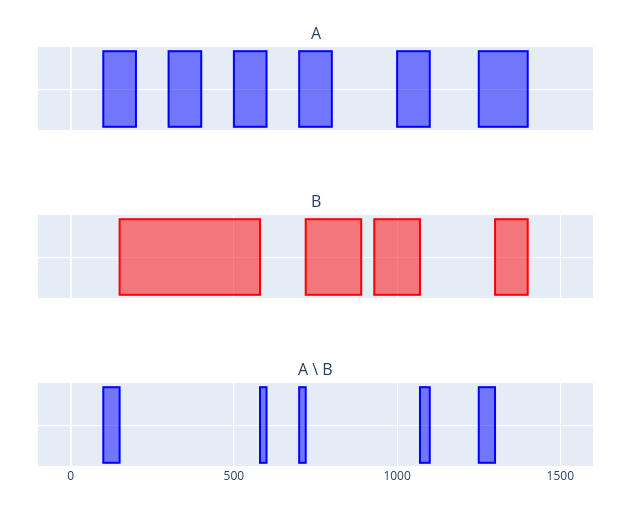

# interval-diff
Implementation of a vectorised interval set difference operation in numpy.

Consider two sets of intervals `A` and `B` such that
```
A     : (----)  (----)  (----)  (----)         (----) (------)
B     :    (---------------)      (------)  (----)      (----)
```

We'd like to calculate `A \ B` where `A \ B` is
```
A \ B : (--)               (-)  (-)              (--) ()
```

## Installation
Clone the repo to your system and install

```bash
$ git clone https://github.com/BlakeJC94/interval-diff
$ cd interval-diff
$ pip install .
```

## Quickstart
To use this algorithm, simply import and use it:
```python
>>> import numpy as np
>>> from interval_diff.vectorised import interval_difference
>>> intervals_a = np.array(
...     [
...         (100, 200),
...         (300, 400),
...         (500, 600),
...         (700, 800),
...         (1000, 1100),
...         (1250, 1400),
...     ]
... )
>>> intervals_b = np.array(
...     [
...         (150, 580),
...         (720, 890),
...         (930, 1070),
...         (1300, 1400),
...     ]
... )
>>> result = interval_difference(intervals_a, intervals_b)
>>> print(result)
# [[ 100.  150.]
#  [ 580.  600.]
#  [ 700.  720.]
#  [1070. 1100.]
#  [1250. 1300.]]
```

This algorithm is also made to work for pandas Dataframes where the interval starts/ends are
located in the columns `'start'`/`'end'`. Any additional metadata in other columns is preserved.
```python
>>> import pandas as pd
>>> intervals_a = pd.DataFrame(intervals_a, columns=['start', 'end'])
>>> intervals_a['tag'] = ["Q", "W", "E", "R", "Q", "R"]
>>> intervals_b = pd.DataFrame(intervals_b, columns=['start', 'end'])
>>> result = interval_difference(intervals_a, intervals_b)
>>> print(result)
#     start     end tag
# 0   100.0   150.0   Q
# 1   580.0   600.0   E
# 2   700.0   720.0   R
# 3  1070.0  1100.0   Q
# 4  1250.0  1300.0   R
```

To visualise the intervals, the included plotly function can be used
```python
>>> from interval_diff.vis import plot_intervals
>>> fig = plot_intervals(
...     [intervals_a, intervals_b, result],
...     names=["A", "B", "A \ B"],
...     colors=["blue", "red", "blue"],
... )
>>> fig.show()
```



To run a quick benchmark, use the CLI interface
```bash
$ interval-diff
100%|█████████████████████████████████████████████████████| 21/21 [00:23]
-------------------------------------------------------------------------
 [np] Intervals (3 samples)  | Non-vec mean (s)    | Vec mean (s)
-------------------------------------------------------------------------
 20                          | 0.000102            | 0.000159
 100                         | 0.000916            | 0.000177
 500                         | 0.017802            | 0.000369
 1000                        | 0.063827            | 0.000594
 2000                        | 0.239962            | 0.001068
 5000                        | 1.479928            | 0.002769
 10000                       | 5.907383            | 0.005583
```
Results will be written to `results_np.csv`

Performance on pandas dataframes can be benchmarks as well with the `--dataframe` (or `-d`) flag:
```bash
$ interval-diff -d
100%|█████████████████████████████████████████████████████| 21/21 [00:23]
-------------------------------------------------------------------------
 [pd] Intervals (3 samples)  | Non-vec mean (s)    | Vec mean (s)
-------------------------------------------------------------------------
 20                          | 0.001687            | 0.001906
 100                         | 0.002548            | 0.001858
 500                         | 0.018257            | 0.002021
 1000                        | 0.064690            | 0.002327
 2000                        | 0.254618            | 0.002722
 5000                        | 1.514108            | 0.004365
 10000                       | 5.988335            | 0.007742
```
Results will be written to `results_pd.csv`

Parameters can be configured with the `--n-intervals` (`-n`) and `--n-samples` (`-k`) flags like
so:
```bash
$ interval-diff --n-intervals 10000 15000 20000 --n-samples 5
100%|█████████████████████████████████████████████████████| 15/15 [03:43]
-------------------------------------------------------------------------
 [np] intervals (5 samples)  | Non-vec mean (s)    | Vec mean (s)
-------------------------------------------------------------------------
 10000                       | 6.215123            | 0.005356
 15000                       | 13.867577           | 0.007547
 20000                       | 24.554746           | 0.009645
```

## Future developments
- [ ] Refactor tests

## Contributing
Pull requests are most welcome!

* Code is styled using `[black](https://github.com/psf/black)`
    * Included in dev requirements
* Code is linted with `pylint` (`pip install pylint`)
* Requirements are managed using `pip-tools` (run `pip install pip-tools` if needed)
    * Add dependencies by adding packages to `setup.py` and running
      `./scripts/compile-requirements.sh`
    * Add dev dependencies to `setup.py` under `extras_require` and run
      `./scripts/compile-requirements-dev.sh`
* [Semantic versioning](https://semver.org) is used in this repo
    * Major version: rare, substantial changes that break backward compatibility
    * Minor version: most changes - new features, models or improvements
    * Patch version: small bug fixes and documentation-only changes

Virtual environment handling by `pyenv` is preferred. Run `./scripts/create-pyenv.sh` for a quickstart
